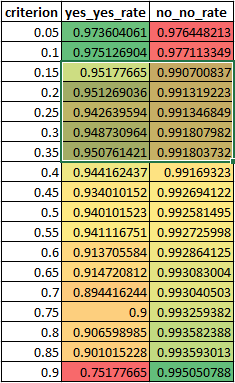

#Denial Reason Prediction Model
------

##Terminology

- Sample - a row of data
- Entry - a row of data
- Class - the prediction label
- Train data - data set with Class label
- Test data - data set without Class label

##Prerequisite for running the code

- [Python3](https://www.python.org/download/releases/3.3.3/)
- [numpy](https://sourceforge.net/projects/numpy/files/)
- [pandas](https://pypi.python.org/pypi/pandas/0.16.0/#downloads)
- [sklearn](http://scikit-learn.org/dev/install.html#windows)
- [angora](https://github.com/MacHu-GWU/Angora)

##The goal

The data has following variables.

	"Claim.Number"
	"Claim.Line.Number"
	"Member.ID"
	"Provider.ID"
	"Line.Of.Business.ID"
	”Revenue.Code"
	"Service.Code"
	"Place.Of.Service.Code"
	"Procedure.Code"
	"Diagnosis.Code"
	“Claim.Charge.Amount"
	"Denial.Reason.Code" <=== Class
	"Price.Index"
	"In.Out.Of.Network"
	"Reference.Index"
	"Pricing.Index"
	"Capitation.Index"
	"Subscriber.Payment.Amount"
	"Provider.Payment.Amount"
	"Group.Index"
	"Subscriber.Index"
	"Subgroup.Index"
	"Claim.Type"
	"Claim.Subscriber.Type"
	"Claim.Pre.Prince.Index"
	"Claim.Current.Status"
	"Network.ID"
	"Agreement.ID"

The goal is to develop a analytic and/or predictive model to predict claims that would be denied with the following Denial.Reason.Code: F13, J8G, JO5, JB8, JE1, JC9, JF1, JF9, JG1, JPA and JES. **For succinct reason, I label samples as 1/yes or 0/no**:
	
	1 - Denial.Reason.Code falls in set([F13, J8G, JO5, JB8, JE1, JC9, JF1, JF9, JG1, JPA and JES])
	0 - Denial.Reason.Code not falls in ...

##Before hands on analysis, understand the data

The train data set has:

- 28 columns
- 472559 rows
- 1971 entries = class 1, 0.42%
- 259 distinct Denial.Reason.Code
- 3 columns are numeric type (continuous numeric value)

	["Claim.Charge.Amount", "Subscriber.Payment.Amount", "Provider.Payment.Amount"]

- 17 columns are category type (discrete tag value)

	["Revenue.Code", "Service.Code", "Procedure.Code", "Diagnosis.Code", 
	"Price.Index", "In.Out.Of.Network", "Reference.Index",
	"Capitation.Index", "Group.Index", "Subscriber.Index", "Subgroup.Index",
	"Claim.Type", "Claim.Subscriber.Type", "Claim.Pre.Prince.Index",
	"Claim.Current.Status", "Network.ID", "Agreement.ID"]

- other columns are useless ID type.
	
	["Claim.Number", "Claim.Line.Number", "Member.ID", "Provider.ID", ... etc]

I think if we have [confusion matrix](http://en.wikipedia.org/wiki/Confusion_matrix) like this, **we care actual Yes - predict Yes more than actual No - predict No**. (Because even we predict all as No, we got 1-0.42% = 99.58% recognition rate. It's useless.)

So next step would be selecting right features we can use for this classification.

###code link

- [dev01_understand_the_data.py](dev01_understand_the_data.py)

##Feature selection analysis 1 - numeric type columns

Usually numeric variable has more information to use than nominal variable. So I start with numeric columns. First thing is to figure out if there's any pattern for samples with 'class = 1/Yes'. Here is what I found:

if class = 1:

	- Claim.Charge.Amount are usually falls in 0 ~ 100,000
	- Subscriber.Payment.Amount_vs_class are usually falls in 0 ~ 0.05
	- Provider.Payment.Amount_vs_class are usually falls in 0 ~ 1,400

Although, the most of class1 have strong pattern in ["Claim.Charge.Amount", "Subscriber.Payment.Amount", "Provider.Payment.Amount"]. **However the word 'strong' only means large P(fall in range)/P(class = 1). But we actually need probability of P(class = 1)/P(fall in range) to predict. Because the prediction task is that, given a sample with specific attributes, find out the probability it is class = 1**. So I did another calculation to exam how much we can trust these three numeric columns:

	P(class = 1)/ (P(Claim.Charge.Amount in range) * (P(Subscriber.Payment.Amount in range) * (P(Provider.Payment.Amount in range)) = 0.426% --- Poor rate

Thus, we cannot trust numeric columns in this classification problem

###code link

- [dev02_analysis_numeric_type_columns.py](dev02_analysis_numeric_type_columns.py)

##Feature selection analysis 2 - category type columns

This analysis is to find out that each category type column is how useful for this classification. For illustration reason, let's take "Revenue.Code" as example. "Revenue.Code" has 191 distinct keys. Then I calculate:
	
	P(class = 1) / P(revenue.code = value)

for all 191 keys. So we can get a table like this. (sort by probability, descent)

Based on this, we can say that if I got a sample with Reveneue.Code = 0810, we have 50% possibility that it is class 1. But only 2 samples out of 472559 have Reveneue.Code = 0810. Compared to this, Reveneue.Code = 0260 only have 18.3% chance to fall in class 1, however we have 4378 samples out of 472599 have Reveneue.Code = 0260. So we cannot only use any single key to build the classifier, even it has 100% probability but have only a few samples.

	Open significant.xlsx for result of this analysis for every category type columns

###code link

- [dev03_analysis_category_type_columns.py](dev03_analysis_category_type_columns.py)
- [significant.xlsx](significant.xlsx)

##The idea

In order to apply [naive bayesian classifier ](http://en.wikipedia.org/wiki/Naive_Bayes_classifier), we have to group those keys. Because we cannot trust those code have high posterior probability if they don't have enough samples appeared in out data-set. This is how I group them:

    for column in ["Revenue.Code", "Service.Code", "Procedure.Code", "Diagnosis.Code", "Subscriber.Index"]
    	group distinct keys (usually more than 100) into 3 group:
	        groupID = 1. high probability group (if group == 1, then P(class == 1) >= 0.1 (estimated))
	        groupID = 2. low probability group (if group == 2, then P(class == 1) < 0.005 (estimated))
	        groupID = 3. zero probability group (if group == 2, class = 0)

After that, we can have a processed data-set like this (relabel them):

Now it's the time to test our model on Naive Bayesian Classifier

###code link

- [dev04_preprocess_train_data.py](dev04_preprocess_train_data.py)
- [train.txt](train.txt)

##Experiment

###design

I use the data in "train.txt", which has 472559 rows, 6 columns. The last column is the label. (1 means denial.code is one of codes we cared). **We use the yes-to-yes, no-to-no recognition rate to evaluate our model**. Here's the definition for yes-to-yes, no-to-no rate.

###train, test split

I use Kfolder cross-validation method to split train/test dataset.

	1. split 472599 entries into 1971 class1 group and 470588 class0
	2. randomly select 90% class1 and 90% class0 and concatenate them as train.
	3. use the rest of 10% class1 and 10% class0 as test.
	4. use train data to derive bayesian probability. and predict test label.
	5. calculate yes-to-yes rate and no-to-no rate
	6. repeat step2 - 5 10times
	7. use the average recognition rate as the final result.

###result analysis and parameter setting

In naive bayesian classification, we can calculate a probability that it is class 1. So we have to set a criterion that if probability >= criterion, we predict it as class 1, otherwise class 0. Intuitively, **the larger the criterion is, the smaller yes-to-yes rate and greater no-to-no rate**. Because larger criterion makes rules to classify sample to class 1 more 'restrict'.

In order to reveal how criterion changes the performance of my classifier, I make a table that criterion from 0.05 to 0.90 and corresponding yes-to-yes, no-to-no rate. (green color means better rate.)

I should say, criterion from (0.15 to 0.35) is a good choice for this classifier.
So we can get 95% yes-to-yes and 99.2% no-to-no recognition rate.

###discuss, parameter optimization

Because the background information are not given, so let's talk about how to choose the best parameter for the classifier.

For example, if the story is that a company apply for a big loan from a bank (let's say 10,000,000$). Failed to deny it cause 8,000,000$ lose. But the bank usually approves individual loan that amount is around 50,000$. So big company is the 'Denial.Reason.Code: F13, J8G...' case. 

Lending money to big company is very risky. But failed to get small loan back is not that important. Because some time people just are not able to pay it on time, but they will pay it finally. Let's say the lose per person is around 10,000$. (**Based on the history data and the evaluation for the specific case, it is not hard to get a cost value. That's why I can assume it this way.**).

Suppose:

	yes_to_yes = a1, yes_to_no = 1-a1
	no_to_no = b1, no_to_yes = 1-b1

So the cost function is:

	cost = Func(criterion) = (1-a1) * 1971 * 8,000,000 + (1-b1) * (472559 - 1971) * 10,000

Now we just need to choose the parameter can minimize the **cost function**. That's it.

If you do not have a cost function to estimate your lose, just use ROC curve as reference.

###code link

- [dev05_classify.py](dev05_classify.py)
- [parameter_analysis](parameter_analysis)